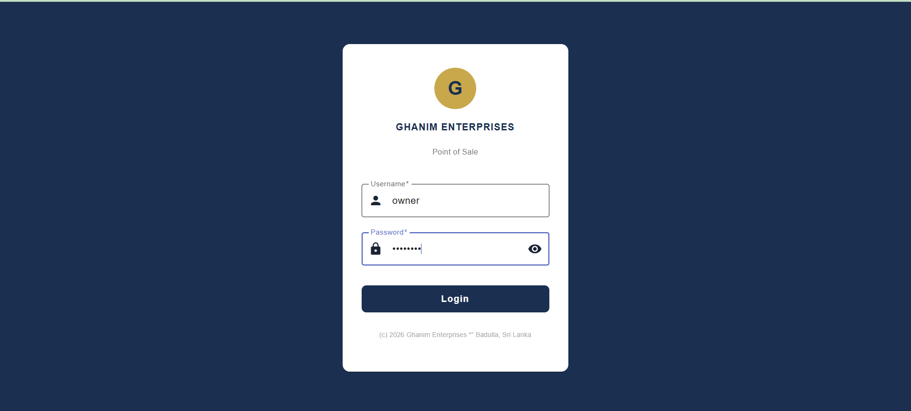
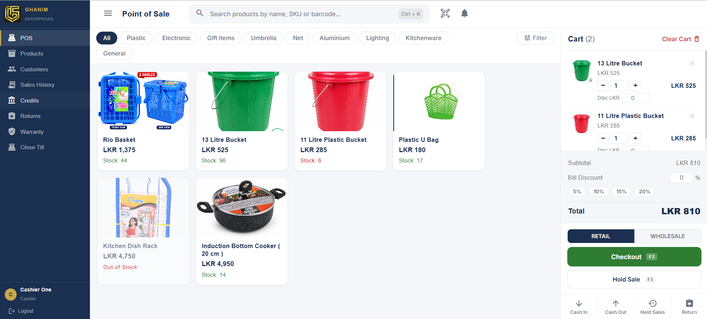
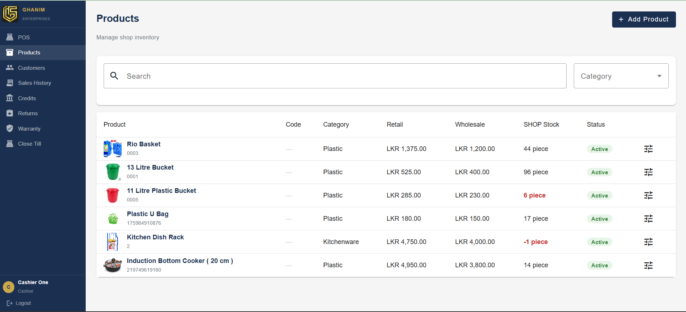
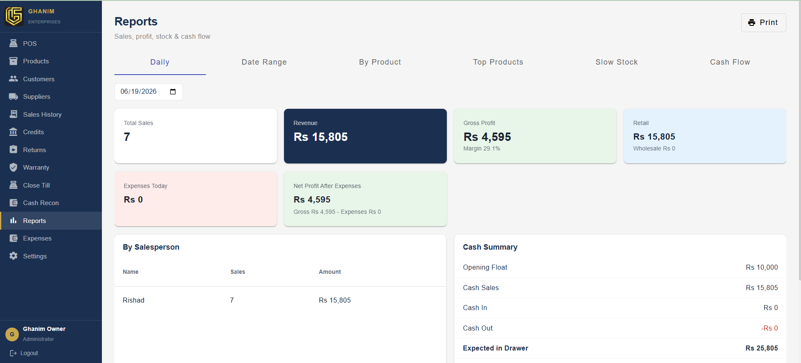
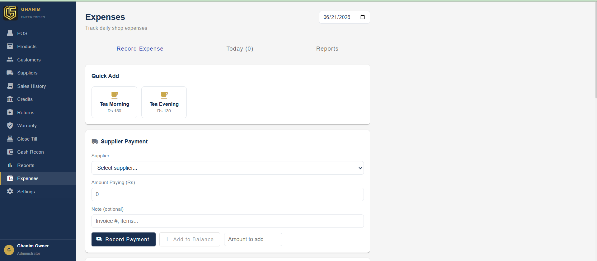
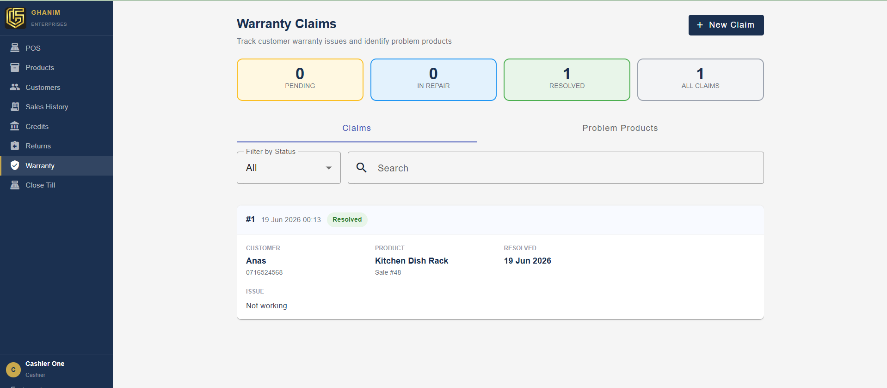
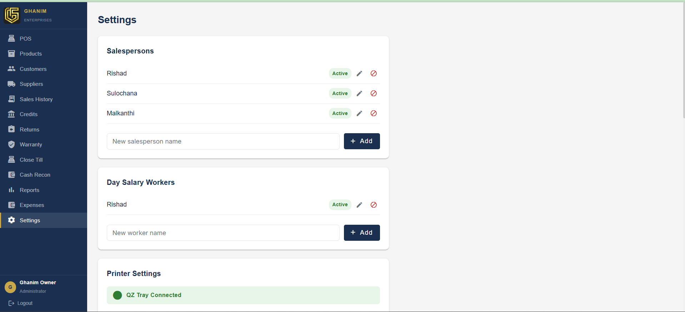

# Point of Sale System

A full-stack POS system for retail shops. Handles retail & wholesale sales, inventory, customer credits, warranty claims, expenses, and owner-level reporting — all from a single browser-based interface.

---

## Tech Stack

| Layer | Technology |
|---|---|
| Frontend | Angular 17, Angular Material, SCSS |
| Backend | Spring Boot 3, Java 21, JPA / Hibernate |
| Database | PostgreSQL |
| Auth | JWT (role-based: Owner / Cashier) |
| Image Storage | ImageKit |
| Receipt Printing | QZ Tray |

---

## Screenshots

### Login


---

### POS — Point of Sale


Products are browsable by category with barcode / name search. The cart supports retail and wholesale pricing, bill-level discounts, hold sale, and checkout.

---

### Products


Manage inventory with retail/wholesale pricing, stock levels, barcode, category, and status. Low-stock items are highlighted in red.

---

### Reports *(Owner only)*


Daily, date-range, by-product, top products, slow stock, and cash flow reports. Shows revenue, gross profit, margin, expenses, net profit, and a full cash summary with opening float.

---

### Expenses *(Owner only)*


Quick-add preset expenses and record supplier payments directly from the expenses screen.

---

### Warranty Claims


Log and track customer warranty issues per product and per sale. Status flow: Pending → In Repair → Resolved. Problem products tab aggregates repeat offenders.

---

### Settings *(Owner only)*


Manage salespersons, day-salary workers, and printer configuration (QZ Tray connection status shown live).

---

## Features

**POS / Sales**
- Retail and wholesale checkout
- Barcode scan + category filter
- Hold & recall sales
- Sale cancellation with manager PIN and reason

**Inventory**
- Product CRUD with ImageKit image upload
- Shop stock tracking, stock adjustments
- Low-stock warnings

**Customers & Credits**
- Customer profiles with credit balance
- Credit payment recording

**Returns**
- Process item-level returns against original sales
- Automatic stock restoration

**Warranty**
- Track claims by customer, product, and sale
- Identify problem products

**Sessions & Cash**
- Open/close till sessions with opening float
- Cash In / Cash Out movements
- Cash reconciliation report

**Reports** *(Owner)*
- Daily, date-range, by-product analytics
- Top-selling and slow-moving stock
- Cash flow summary
- Expense tracking with supplier payments

**Settings**
- Salesperson management
- Day-salary worker management
- QZ Tray thermal printer integration

---

## Getting Started

### Prerequisites
- Java 21
- Node.js 18+
- PostgreSQL 15+

### Backend

```bash
cd pos-backend
# Configure application.properties (DB credentials, JWT secret, ImageKit keys, manager PIN)
./mvnw spring-boot:run
```

### Frontend

```bash
cd pos-frontend
npm install
ng serve
```

Open [http://localhost:4200](http://localhost:4200).

---

## Environment Variables

| Variable | Description |
|---|---|
| `SPRING_DATASOURCE_URL` | MySQL JDBC URL |
| `SPRING_DATASOURCE_USERNAME` | DB username |
| `SPRING_DATASOURCE_PASSWORD` | DB password |
| `JWT_SECRET` | JWT signing secret |
| `IMAGEKIT_PUBLIC_KEY` | ImageKit public key |
| `IMAGEKIT_PRIVATE_KEY` | ImageKit private key |
| `IMAGEKIT_URL_ENDPOINT` | ImageKit URL endpoint |
| `MANAGER_PIN` | 4-digit PIN for protected actions (default: `1234`) |
| `ALLOWED_ORIGINS` | CORS allowed origin (default: `http://localhost:4200`) |
